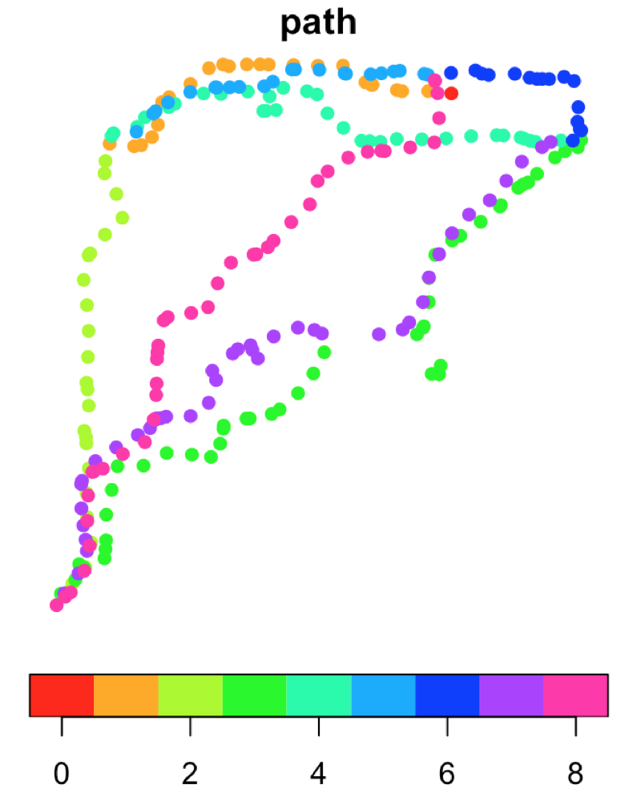
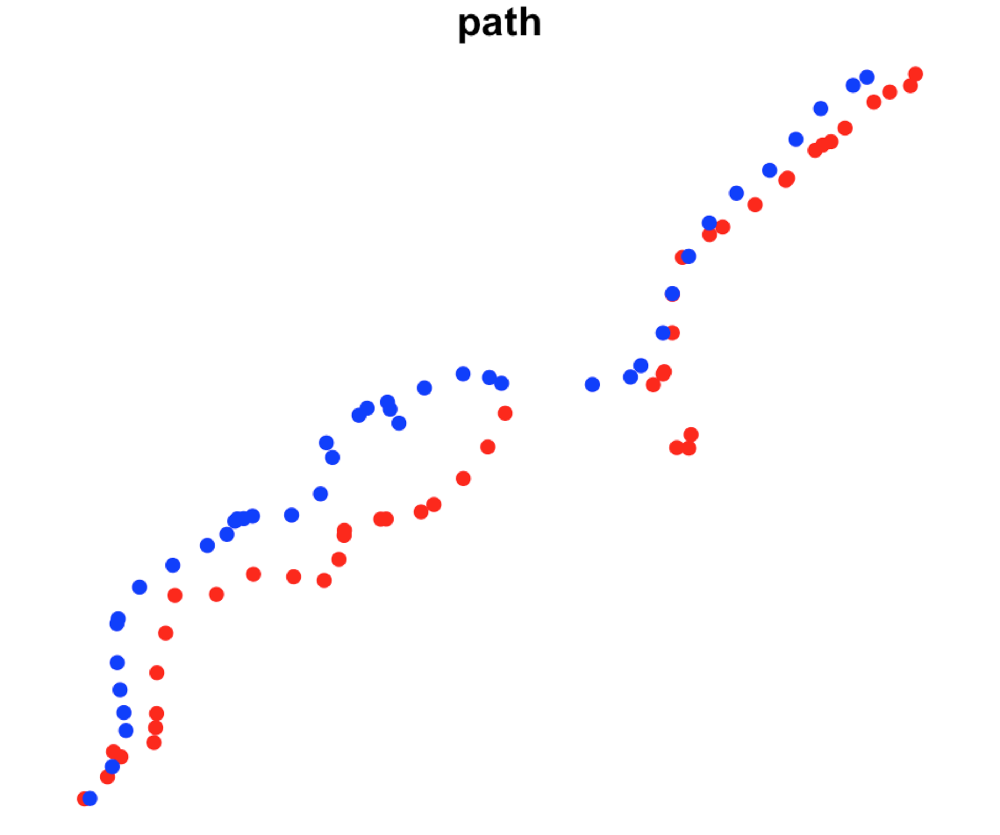
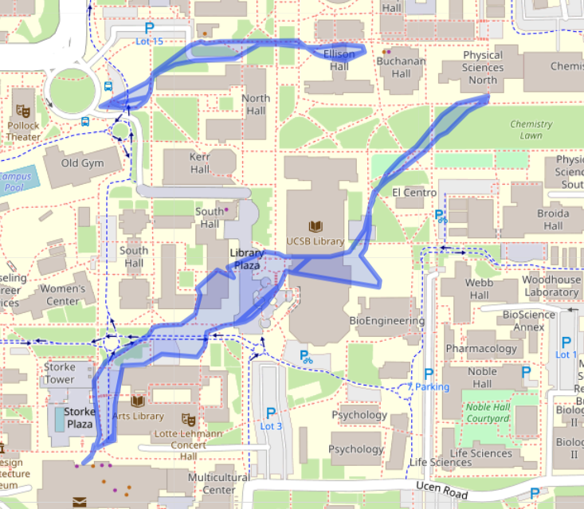

# paths R package
 
The repository holds  functions to process GPX data, define routes, and process trip statistics. Two examples follows:

```r
install.packages("devtools")
devtools::install_github("mikejohnson51/paths")
```
## Install needed libraries

```r
library(dplyr)
library(sf)
library(paths)
```

## Needed Input Data:

First we define the projection we want to work with, in this case California State Plane 5.

```r
proj = 2229
```

Next, a set of locations people navigated to. In this case we read data from a shapefile and assign a name attribute to each location:

```r
truth = read_sf('./data/Endpoints.shp') %>% 
  mutate(location =  c('EH', "BL", "BS", "S")) 

Simple feature collection with 4 features and 2 fields
geometry type:  POINT
dimension:      XY
bbox:           xmin: -119.8481299 ymin: 34.41180508 xmax: -119.8435924 ymax: 34.41561101
epsg (SRID):    4326
proj4string:    +proj=longlat +datum=WGS84 +no_defs
# A tibble: 4 x 3
     Id                   geometry location
* <int>                <POINT [°]> <chr>   
1     0  (-119.844972 34.41561101) EH      
2     0 (-119.8479383 34.41510219) BL      
3     0 (-119.8481299 34.41180508) BS      
4     0 (-119.8435924 34.41520288) S       
> 
```
Lastly, an ordered vector of which locations were visited.

```r 
route = c("EH", "BL", "BS", "S","BL", "EH", "S","BS","EH")
```

# Example 1: Single GPX files

## Reading in and segmenting a GPX file

A GPX file stores location data from the time the device was turned on until it is turned off. In this section we show how to (1) read GPX data into R and (2) break the continuous path into a set of segments defined by the truth points and route provided above.

We can process the gpx file using the `paths` package and transform it to the desire projection:

```r
path = "./data/subject3.gpx" 

gps = gpx_to_pts(path) %>% st_transform(proj) 
  
Simple feature collection with 248 features and 2 fields
geometry type:  POINT
dimension:      XY
bbox:           xmin: 6004258.767 ymin: 1977318.794 xmax: 6005678.188 ymax: 1978782.115
epsg (SRID):    NA
proj4string:    +proj=lcc +lat_1=34.03333333333333 +lat_2=35.46666666666667 +lat_0=33.5 +lon_0=-118 +x_0=2000000 +y_0=500000.0000000001 +ellps=GRS80 +towgs84=0,0,0,0,0,0,0 +units=us-ft +no_defs
First 10 features:
           ele                time                       geometry
1  16.00000000 2018-11-15 20:08:08 POINT (6005327.012 1978703....
2  16.00000000 2018-11-15 20:08:29 POINT (6005264.347 1978709....
3  16.00000000 2018-11-15 20:08:42 POINT (6005193.799 1978709....
4  16.00000000 2018-11-15 20:08:44 POINT (6005179.495 1978712....
5  16.00000000 2018-11-15 20:08:55 POINT (6005113.665 1978726....
6  16.00000000 2018-11-15 20:08:56 POINT (6005110.224 1978726....
7  16.00000000 2018-11-15 20:08:59 POINT (6005094.523 1978733....
8  16.00000000 2018-11-15 20:09:11 POINT (6005033.687 1978778.82)
9  15.80000019 2018-11-15 20:09:26 POINT (6004965.893 1978778....
10 15.80000019 2018-11-15 20:09:41 POINT (6004899.863 1978780....
```

We the can use the `paths` package to assign path IDs based on the prescribed route.

```r
gps_with_routes = add_paths(gps, truth, route) 

Simple feature collection with 248 features and 3 fields
geometry type:  POINT
dimension:      XY
bbox:           xmin: 6004258.767 ymin: 1977318.794 xmax: 6005678.188 ymax: 1978782.115
epsg (SRID):    NA
proj4string:    +proj=lcc +lat_1=34.03333333333333 +lat_2=35.46666666666667 +lat_0=33.5 +lon_0=-118 +x_0=2000000 +y_0=500000.0000000001 +ellps=GRS80 +towgs84=0,0,0,0,0,0,0 +units=us-ft +no_defs
First 10 features:
           ele                time                       geometry path
1  16.00000000 2018-11-15 20:08:08 POINT (6005327.012 1978703....    0
2  16.00000000 2018-11-15 20:08:29 POINT (6005264.347 1978709....    1
3  16.00000000 2018-11-15 20:08:42 POINT (6005193.799 1978709....    1
4  16.00000000 2018-11-15 20:08:44 POINT (6005179.495 1978712....    1
5  16.00000000 2018-11-15 20:08:55 POINT (6005113.665 1978726....    1
6  16.00000000 2018-11-15 20:08:56 POINT (6005110.224 1978726....    1
7  16.00000000 2018-11-15 20:08:59 POINT (6005094.523 1978733....    1
8  16.00000000 2018-11-15 20:09:11 POINT (6005033.687 1978778.82)    1
9  15.80000019 2018-11-15 20:09:26 POINT (6004965.893 1978778....    1
10 15.80000019 2018-11-15 20:09:41 POINT (6004899.863 1978780....    1


plot(gps_with_routes['path'], pch = 16, pal  = rainbow(9), key.pos = 1)

```



## Identify Simular Paths from Route Vector

With the goal of comparing the route a person selects a between two points when traveling in opposite directions we need to identify the path IDs that designate similar paths. We can use the `paths` package to find the similar paths, within the given route:

```r
same_paths = find_same_paths(route)

  Path1 Path2 start end
1     1     5    EH  BL
2     3     7    BS   S

```
Here we see that four of the 8 paths (1,5,3,7) are replicate paths. Paths 1 and 5 both walk between 'EH' and 'BL', while paths 3 and 7 both walk between 'BS' ans 'S'. To check, we can plot routes 3, 7 below:

```r
gps_with_routes %>% filter(path %in% c(3,7)) %>% select(path) %>% plot(pch=16, pal = c("red", "blue"), key.pos = NULL)
```



## Calcuating path length, areas of overlap, and time of trips

Using the spatial GPX file with path IDs, list of self-similar routes, and known locations, we can calculate the total non-overlapping area created by taking the space between each route and the Euclidean (straight-line) connector. This operation is contained in the `compare_paths()` function:

```r
out = compare_paths(gps_with_routes, same_paths, truth)
```

We can plot the polygons, 
```r
leaflet() %>% addTiles() %>% addPolygons(data = st_transform(out, AOI::aoiProj))
```




Or, extract the attribute data calculated within the function.

```r
out %>% st_drop_geometry() 

  start  end area           straight_length  path1_length  path2_length path1_time path2_time
1    EH  BL  2872.95 [m^2]   278.45 [m]      315.09 [m]    293.34 [m]   3.41 mins  3.25 mins
2    BS  S   13135.582 [m^2] 562.17 [m]      701.64 [m]    662.89 [m]   8.10 mins  7.41 mins
```

# Example 2: Processing many GPX files

A single GPX file can be processed by chaining the above commands using the pipe ( %>% ) operator.

```r
gps = gpx_to_pts(path) %>% 
  st_transform(proj) %>% 
  add_paths(truth, route) %>% 
  compare_paths(same_paths, truth)
```

We can extend this functionality to process many files at once:

```r
# Define all gpx files in a folder
gpx_files = list.files("./data/", pattern = 'gpx', full.names = T)

#Create function that processes a file path, adds the subject ID, and extracts the attribute data
process = function(x) {
  gpx_to_pts(x) %>%
    st_transform(proj) %>%
    add_paths(truth, route) %>%
    compare_paths(same_paths, truth) %>%
    mutate(subject = gsub("\\.gpx", "", gsub("subject", "", basename(x)))) %>%
    st_drop_geometry()
}

# Apply this fucntion over the list of GPX files 
ll = lapply(gpx_files, process)

# Bind all returned output into a single data.frame
data = do.call(rbind, ll) %>% mutate_at(3:8, round, 2)

  start end           area straight_length path1_length
1    EH  BL 10003.74 [m^2]      278.46 [m]   356.28 [m]
2    BS   S 17594.85 [m^2]      562.18 [m]   676.81 [m]
3    EH  BL  2872.95 [m^2]      278.46 [m]   315.09 [m]
4    BS   S 13135.58 [m^2]      562.18 [m]   701.64 [m]
5    EH  BL  3253.59 [m^2]      278.46 [m]   381.07 [m]
6    BS   S 20774.04 [m^2]      562.18 [m]   712.95 [m]
7    EH  BL  9367.26 [m^2]      278.46 [m]   322.01 [m]
8    BS   S  6722.92 [m^2]      562.18 [m]   690.87 [m]
  path2_length path1_time path2_time subject
1   307.43 [m]  4.27 mins  3.37 mins      20
2   704.95 [m]  8.03 mins  8.25 mins      20
3   293.35 [m]  3.42 mins  3.25 mins       3
4   662.90 [m]  8.10 mins  7.42 mins       3
5   364.79 [m]  3.55 mins  3.55 mins      31
6   663.84 [m]  6.93 mins  7.18 mins      31
7   306.22 [m]  5.45 mins  4.10 mins      32
8   710.80 [m]  9.93 mins  9.30 mins      32

```

We can also use these results to find summary statistics. Here we look for the average area, and path lengths taken for each similar route across all subjects.

```r
summary = data %>%
  group_by(start) %>%
  summarise(
    meanArea =  mean(area),
    meanPath1 = mean(path1_length),
    meanPath2 = mean(path2_length)
  ) %>%
  mutate_at(2:4, round, 2)

# A tibble: 2 x 4
  start meanArea meanPath1 meanPath2
  <chr>    [m^2]       [m]       [m]
1 BS    14556.85    695.57    685.62
2 EH     6374.38    343.61    317.95

```


